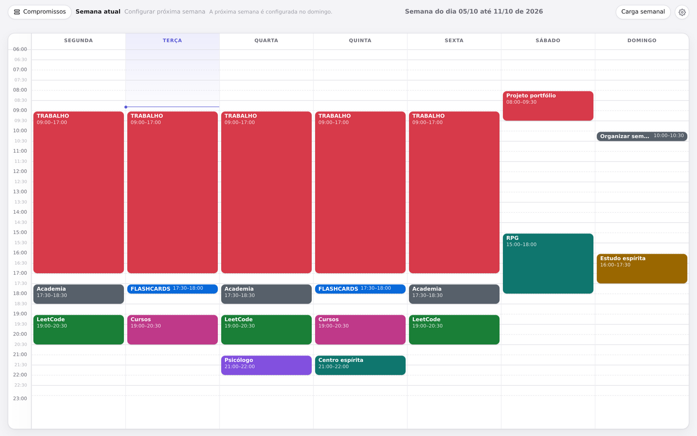
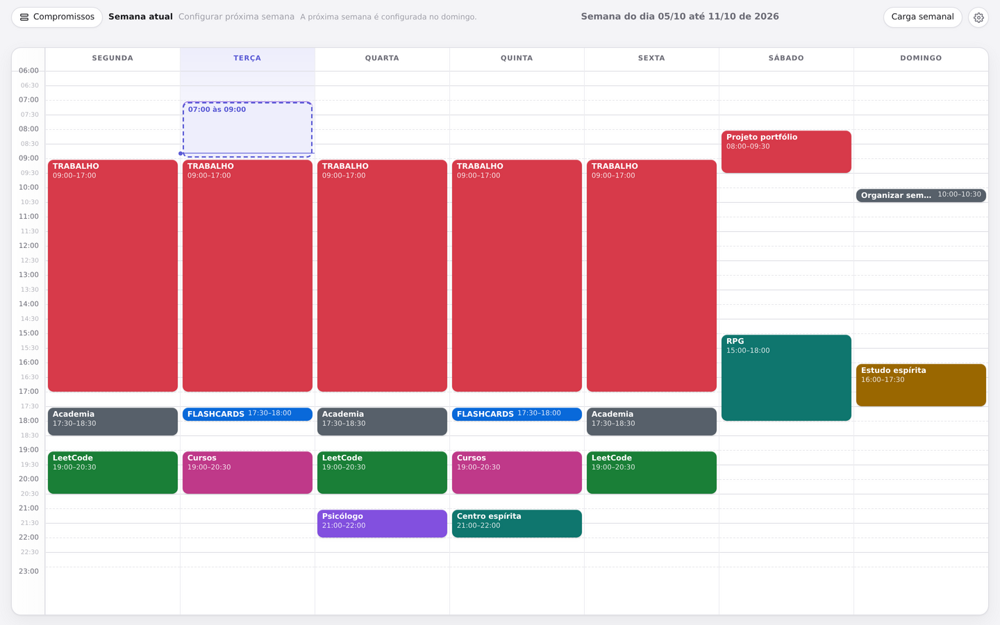
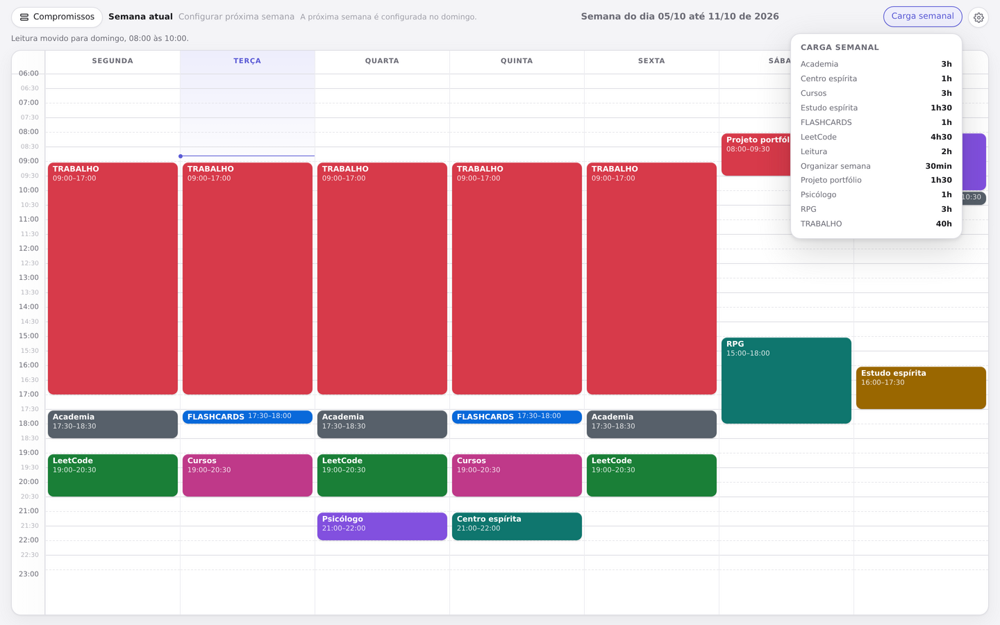
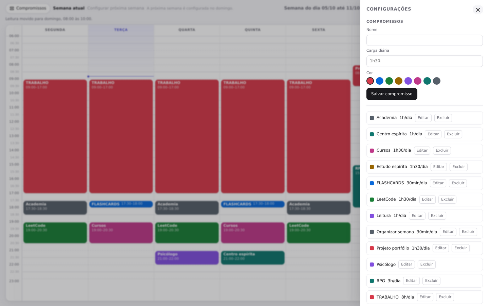
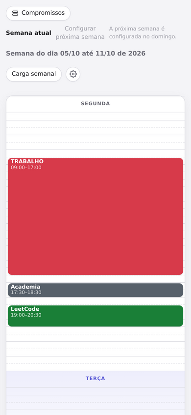

# Rotina

A weekly routine planner: a Monday-to-Sunday grid from 06:00 to 23:00, where you
drag a commitment onto a time slot and **rearranging costs one drag**.

*[Leia em português](README.md)*





## Why it exists

My routine used to live in a spreadsheet. Setting it up was work;
**rearranging** was way too much work — editing cells, recalculating times,
realigning the rest of the day. Then something would change on Wednesday and,
instead of redoing all of it, I'd just drop the plan.

Planning was never the problem: rearranging was. Hence the only criterion that
matters here: **something changes on Wednesday, the rearranging takes seconds**.

## Drag, resize, move


## Weekly load made easy



## Commitments and base routine

Commitments (name, color, daily load) and the base routine live in settings. The
base routine is your default week



## Two weeks, one rollover

The current week and the next one exist at the same time and are both editable

## On mobile

The week stacks the days and stays readable on a phone. Drag-to-edit is a
desktop thing.



## Running locally

Needs Node 20+.

```bash
npm install
npm run db:migrate
npm run dev
```

It comes up at `http://localhost:3000` and the database is created at
`./data/rotina.db`. To point it somewhere else, use `DATABASE_PATH`.
